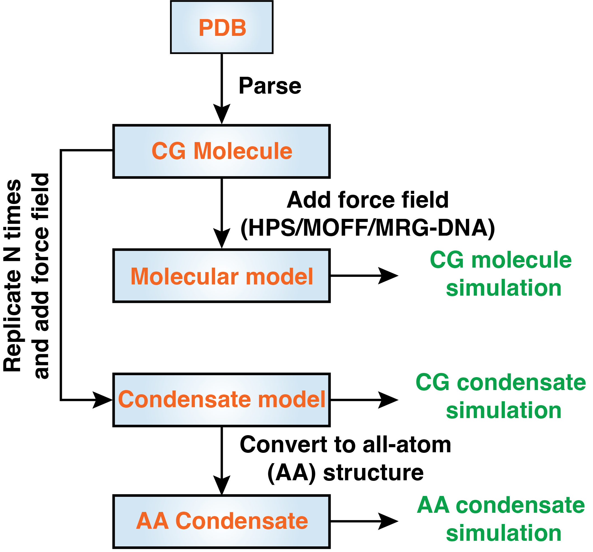

## OpenABC

OpenABC stands for **Open**MM GPU-**A**ccelerated simulations of **B**iomolecular **C**ondensates. It is flexible and implements multiple popular coarse-grained force fields for simulations, including the hydropathy scale (HPS) model, MOFF C<sub>$\alpha$</sub> model, and the molecular renormalization group (MRG)-CG DNA model. The package dramatically simplifies the simulation setup: users only need a few lines of python code to carry out condensate simulations starting from initial configurations of a single protein or DNA. The package is integrated with OpenMM, a GPU-accelerated MD simulation engine, enabling efficient simulations with advanced sampling techniques. We include tools for converting coarse-grained configurations to atomistic structures for further simulations with all-atom force fields. We provide tutorials in Jupyter notebooks to demonstrate the various capabilities. We anticipate OpenABC to significantly facilitate the application of existing computer models for simulating biomolecular condensates and the continued development of new force fields.



## Tutorials

Detailed tutorials with all the necessary input files are provided in "tutorials" directory. 


## Manual

The output html manual file is docs/index.html. 

The manual is also shown in: https://zhanggroup-mitchemistry.github.io/OpenABC/

Instructions for class methods and functions are also included as comments in the source code. 


## Environment

We recommend using openmm 7.5.1 for using OpenABC, as OpenABC is built based on openmm 7.5.1. 

Install openmm 7.5.1 with the following command: `conda install -c conda-forge openmm=7.5.1`

Other required packages: numpy, pandas, mdanalysis, mdtraj. 

If running replica exchange with `openabc.utils.replica_exchange`, then torch is also required. 


## Usage

```python
from openabc.forcefields.parsers import MOFFParser, MRGdsDNAParser
from openabc.forcefields import MOFFMRGModel

# parse atomistic structure protein_AA.pdb, and the output CA model is protein_CA.pdb. 
protein = MOFFParser.from_atomistic_pdb('protein_AA.pdb', 'protein_CA.pdb')
```

Please read the tutorials for more instructions. 


## Citations

We will add citations after the paper is formally online. 


